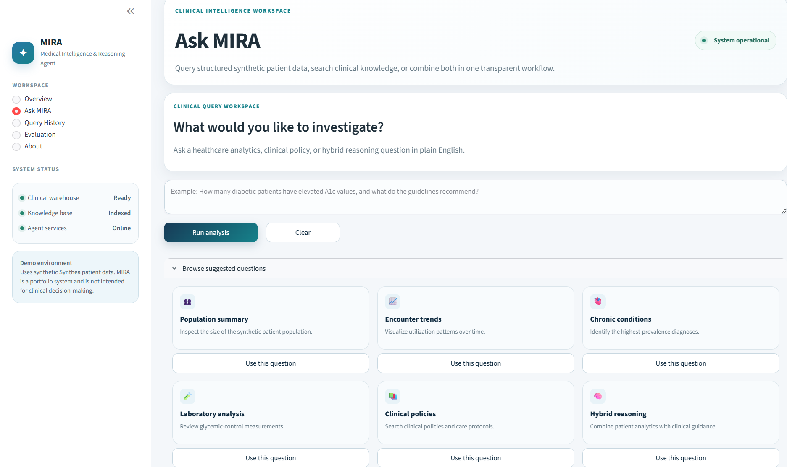

MIRA --- Medical Intelligence and Reasoning Agent

A production-inspired clinical intelligence platform that combineshealthcare data engineering, analytics engineering, Text-to-SQL,retrieval-augmented generation (RAG), and agentic AI to answer clinicalanalytics and policy questions in natural language.

Built using synthetic Synthea healthcare data. MIRA is an engineeringportfolio project and must not be used for real clinicaldecision-making.

Key Results

Metric                             Result

Overall benchmark         48/50 (96%)Core reasoning           47/47 (100%)SQL                      25/25 (100%)Clinical RAG             15/15 (100%)Hybrid Reasoning           7/7 (100%)Synthetic patients              5,760Encounters                     11,722Medication records             14,911Abnormal lab results          178,544Knowledge documents                24

Core SQL, RAG and Hybrid reasoning achieved 100% accuracy.

Why MIRA?

Healthcare analytics traditionally requires SQL expertise, manualdocument review, and multiple handoffs between technical and clinicalteams. MIRA demonstrates how a modern AI application can combinegoverned analytics with clinical knowledge retrieval in a singletransparent workflow.

The platform integrates:

Healthcare data engineering

Analytics engineering with dbt

Text-to-SQL

Clinical RAG

Hybrid reasoning

LangGraph orchestration

MLflow evaluation

Interactive Streamlit dashboard

Dashboard

The Streamlit dashboard allows users to:

Ask natural-language questions

View generated SQL

Inspect retrieved clinical evidence

Explore Plotly visualizations

Review execution traces and query history

<h3 align="center">

MIRA Clinical Intelligence Dashboard

</h3>

{=html}

Natural-language clinical analytics with transparent SQL generation,evidence retrieval, interactive visualizations and executiontraceability.

System Architecture

User
 │
 ▼
Streamlit UI
 │
 ▼
FastAPI
 │
 ▼
LangGraph Agent
 ├── Intent Classification
 ├── Text-to-SQL
 ├── Clinical RAG
 ├── Hybrid Reasoning
 ├── Validation
 └── Visualization
        │
        ▼
DuckDB + PostgreSQL(pgvector)

Major Capabilities

Text-to-SQL

Semantic schema retrieval

LLM-based SQL generation

SQL validation

Retry handling

Evidence generation

Clinical RAG

24 curated clinical guidelines

Vector search

Keyword search

Reciprocal Rank Fusion

Source-grounded answers

Hybrid Reasoning

Questions can simultaneously query structured healthcare data andretrieve relevant clinical guidance before synthesizing a final answer.

Data Engineering

Delta Lake

Apache Parquet

DuckDB analytical warehouse

dbt staging, marts and metrics

Great Expectations

Schema registry generation

Agent Architecture

Nine LangGraph nodes coordinate routing, SQL generation, retrieval,validation, synthesis and visualization while preserving execution stateand traceability.

Evaluation

The benchmark evaluates SQL correctness, RAG quality, hybrid reasoning,visualization, latency, validation and retries.

Category         Accuracy

SQL                  100%Clinical RAG         100%Hybrid               100%Overall               96%

Technology Stack

Python

DuckDB

PostgreSQL + pgvector

LangGraph

LangChain

Groq

dbt

Great Expectations

FastAPI

Streamlit

Plotly

Docker

MLflow

Repository Structure

agent/
api/
frontend/
dbt_project/
pipeline/
vector_store/
mcp_servers/
evaluation/
docs/

Running

git clone https://github.com/ChetanaMuralidharan/Mira.git
cd Mira
python -m venv venv
venv\Scripts\activate
pip install -r requirements.txt

docker compose -f docker/docker-compose.yml up -d

python start_servers.py
uvicorn api.main:app --reload
streamlit run frontend/app.py

Design Decisions

Governed analytical models with dbt

Semantic schema retrieval

Hybrid vector + keyword retrieval

MCP-style tool abstraction

Explicit LangGraph workflow

End-to-end benchmark

Known Limitations

Synthetic healthcare data

Local deployment

Limited visualization benchmark

Curated knowledge corpus

Not clinically validated

Future Enhancements

Role-based dashboards

FHIR integration

Expanded benchmark

CI/CD

Enterprise authentication

Disclaimer

MIRA is an engineering demonstration built with synthetic healthcaredata and is not intended for real clinical use.

Author

Chetana Muralidharan

Data Engineer | AI Engineer | Analytics Engineer

M.S. Applied Data Intelligence --- San Jose State University

GitHub: https://github.com/ChetanaMuralidharan